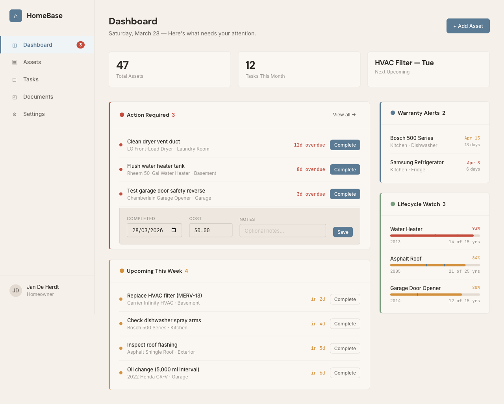
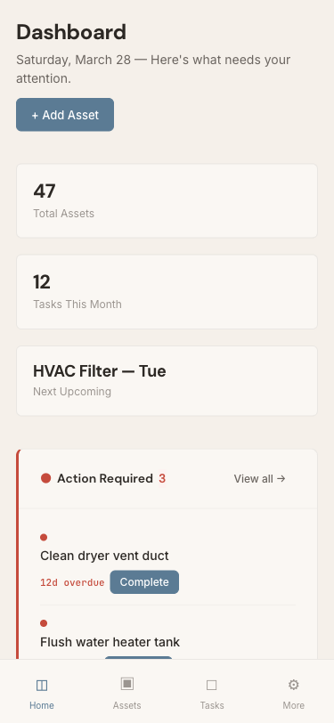
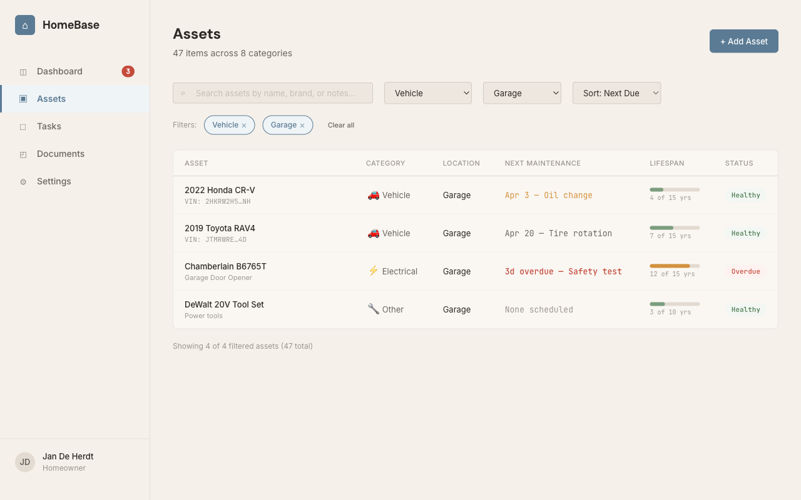
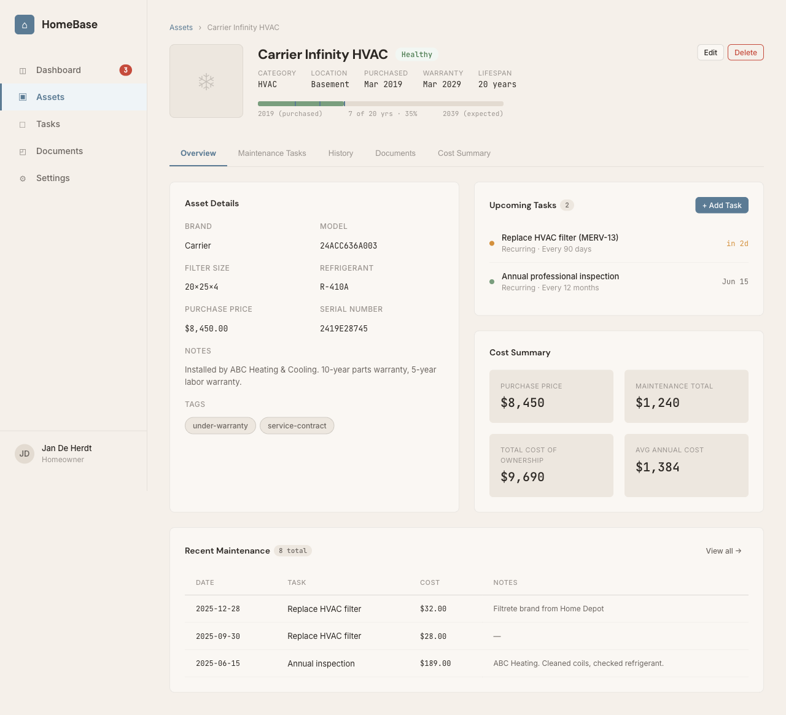
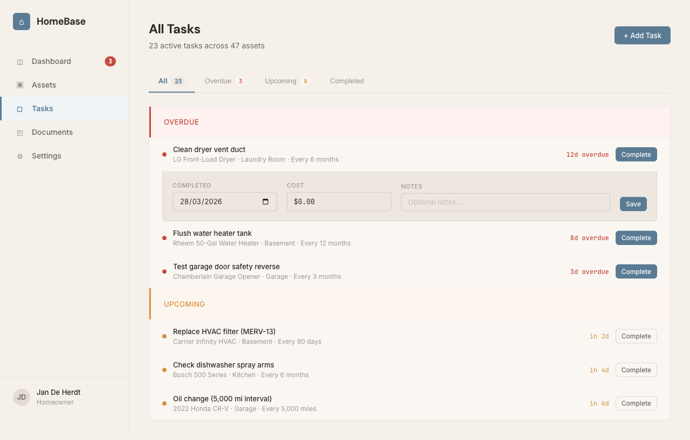
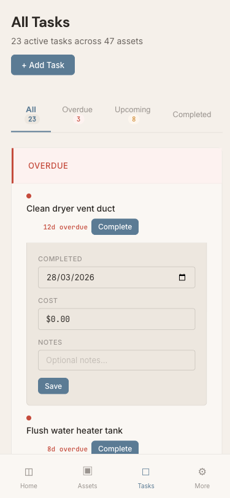

# Design Proposition — HomeBase

## Requirement
Build a self-hosted Home Maintenance & Appliance Lifecycle Tracker as a full-stack web application. Track every appliance, device, system and asset in a home — from the fridge to the roof tiles to the car. Know when maintenance is due, when warranties expire, what things cost, and when to budget for replacements. Fleet management for your house.

## Specification Summary

**7 user stories** across 3 priority tiers, **18 functional requirements**, **6 key entities**:

- **P1 (Core)**: Asset cataloging with 10 category-specific field sets, dashboard with 5-section information architecture (Action Required, Upcoming This Week, Warranty Alerts, Lifecycle Watch, Quick Stats), maintenance task scheduling with inline completion flow
- **P2 (Enhance)**: Cost tracking with TCO calculations and replacement forecasting (3% inflation), full-text search with filtering by category/location/status/tags
- **P3 (Nice-to-have)**: Document management (per-asset tab + top-level page), email notifications via SMTP

**Navigation**: Sidebar (desktop) / bottom tab bar (mobile) — Dashboard, Assets, Tasks, Documents, Settings

**Key interactions**: Inline task completion expansion (date/cost/notes fields below task row), category-specific dynamic form fields, timeline strip lifecycle indicator

## Design Rationale

**Direction: Workshop Ledger**

- **Domain**: Workshop pegboards, maintenance logs, appliance labels, seasonal rhythms, home inspector checklists, warranty cards, hardware stores
- **Color world**: Workshop wood (#B8956A), toolbox red (#C54B3C) for overdue, furnace amber (#D4913D) for upcoming, garden sage (#7A9E7E) for healthy, blueprint slate (#5B7B94) for accent/navigation, concrete gray (#8B8D8F) for structure
- **Signature element**: The maintenance timeline strip — a horizontal lifecycle indicator showing purchase → current age → expected end-of-life, with maintenance events as notches along the bar. Fills with a gradient (sage → amber → red) as the asset ages.
- **Typography**: DM Sans (headings — condensed, industrial), Inter (body — readable workhorse), JetBrains Mono (data — serial numbers, dates, costs, model numbers)
- **Depth strategy**: Borders only, no shadows. Low-opacity rgba borders (`--rule`). Inputs are inset (darker `--bench-inset` background). Cards sit flat on the bench surface.
- **Token vocabulary**: `--bench`, `--bench-raised`, `--bench-inset`, `--ink-primary`, `--rule`, `--timeline-track`, `--timeline-notch`

## Screens

### Dashboard
- Desktop: 
- Mobile: 
- Purpose: Primary landing screen. 5-section layout showing overdue tasks (red accent, primary Complete buttons), upcoming this week (amber accent, ghost Complete buttons), warranty alerts, lifecycle watch with timeline strip signature, and quick stats. Inline task completion expansion with date/cost/notes fields.

### Assets Inventory
- Desktop: 
- Purpose: Searchable, filterable table of all home assets. Each row shows name, category icon, location, next maintenance date, lifespan timeline strip, and status pill (Healthy/Overdue). Active filter chips. Lifespan column hidden on mobile; table scrolls horizontally on tablet.

### Asset Detail
- Desktop: 
- Purpose: Full asset view with timeline strip signature in header showing lifecycle progress with maintenance notches. Tabs for Overview, Maintenance Tasks, History, Documents, Cost Summary. Category-specific HVAC fields (filter size, refrigerant) in monospace. Cost summary with TCO. Maintenance history table.

### Add / Edit Asset
- Purpose: Dynamic form showing category-specific fields (HVAC Details section demonstrated). Photo upload with thumbnail preview and drag-drop zone. Custom tags with inline remove. Cancel/Save actions.

### All Tasks
- Desktop: 
- Mobile: 
- Purpose: Cross-asset task list grouped by status (Overdue/Upcoming) with colored section headers and left-border accents. Tab counts for each status. Inline completion expansion. Sortable by due date, asset, or status.

### Documents
- Purpose: Grid of document cards across all assets. Filterable by document type (Warranty, Receipt, Manual) and asset. File metadata in monospace, type-colored chips, three-dot action menu.

## Iteration History
- **Analysis cycles completed**: 1 (all 7 stories approved on first pass — spec was comprehensive from the start)
- **Design cycles completed**: 3
  - v1: Established Workshop Ledger direction with 6 screens. 4 approved, 2 flagged (7/10)
  - v2: Fixed upcoming button visibility, task section headers, mobile task-asset hidden. Mobile task-name truncation still broken (7.5/10)
  - v3: Fixed mobile task-name wrapping via flex restructure. All 6 approved (8/10)
- **Key design improvements**: Mobile task-item layout restructured for readability, urgency-differentiated button styles, section header breathing room

## Open Questions
1. **Settings page**: Not mocked — covers user profile, notification preferences, SMTP config, currency. Straightforward form layout.
2. **Dark mode**: Not in v1 scope. Token architecture (`--bench`, `--ink` primitives) supports future inversion.
3. **Data import**: CSV/JSON import is "desirable but not required." No UI designed yet.
4. **Loading/skeleton states**: Not in mockups. Recommended: skeleton shapes matching content layout with shimmer animation.
5. **Empty states**: Specified in spec (welcome CTA for zero assets, "No assets yet" for empty inventory) but not mocked as separate screens.

## Files
- Spec: `specs/005-home-maintenance-tracker/spec.md`
- Design rationale: `.design-pipeline/design-rationale.md`
- Mockups hub: `.design-pipeline/mockups/index.html`
- All screens: `.design-pipeline/mockups/screens/`
- Screenshots: `.design-pipeline/screenshots/`
- Design system CSS: `.design-pipeline/mockups/screens/styles.css`
